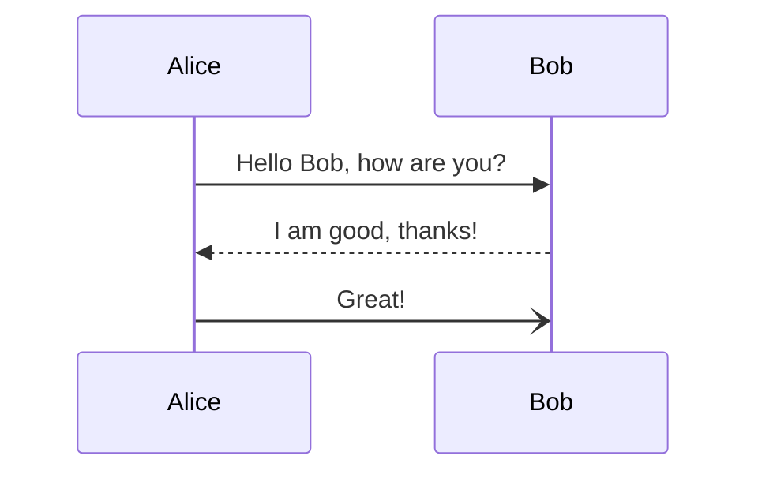
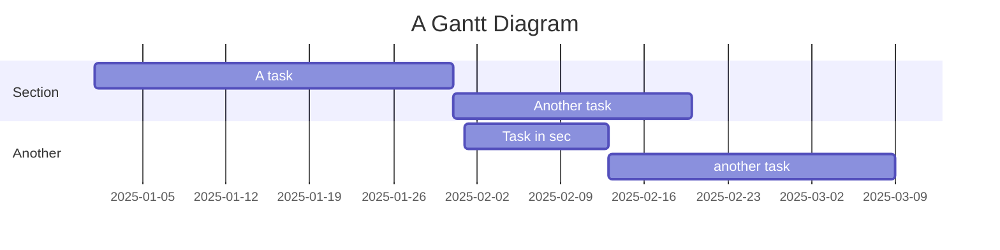

This project is designed to provide a comprehensive example of Markdown usage. It includes various elements such as headings, paragraphs, lists, tables, code snippets, and more.

## Getting Started

To get started with this project, clone the repository and follow the instructions below.

### Prerequisites

Before you begin, make sure you have the following installed:

- Node.js (version 14 or later)
- npm or yarn package manager
- Git

### Installation

1. Clone the repository
2. Install dependencies
3. Start the development server

```bash
git clone https://github.com/example/quantum-computing-intro.git
cd quantum-computing-intro
npm install
npm run dev
```

## Overview

This project is designed to provide a comprehensive example of Markdown usage. It includes various elements such as headings, paragraphs, lists, tables, code snippets, and more.

## Getting Started

To get started with this project, clone the repository and follow the instructions below.

### Prerequisites

```ts
// [!code word:Hello:1]
const message = 'Hello World'
console.log(message) // prints Hello World
```

- Git
- Python 3.x
- Node.js

### Installation

1. Clone the repository:

   ```bash
   git clone https://github.com/username/repo.git
   cd repo
   ```

2. Install Python dependencies:

   ```bash
   pip install -r requirements.txt
   ```

3. Install Node.js dependencies:
   ```bash
   npm install
   ```

## Usage

To run the project, use the following command:

```bash
python main.py
```

## Features

- **Feature 1:** Description of feature 1
- **Feature 2:** Description of feature 2
- **Feature 3:** Description of feature 3

## Examples

### Headings

# Heading 1

## Heading 2

### Heading 3

#### Heading 4

##### Heading 5

###### Heading 6

### Paragraphs

This is a simple paragraph.

This is another paragraph with some **bold** text, _italic_ text, and `inline code`.

Lorem ipsum dolor sit amet, consectetur adipiscing elit. Integer nec odio. Praesent libero. Sed cursus ante dapibus diam. Sed nisi. Nulla quis sem at nibh elementum imperdiet. Duis sagittis ipsum. Praesent mauris. Fusce nec tellus sed augue semper porta.

### Lists

#### Unordered List

- Item 1
- Item 2
  - Subitem 1
  - Subitem 2
    - Subsubitem 1
    - Subsubitem 2
- Item 3

#### Ordered List

1. First item
2. Second item
   1. Subitem 1
   2. Subitem 2
3. Third item

### Links

[GitHub](https://github.com)

[Relative Link](./relative/path.md)

### Images


### Blockquotes

> This is a blockquote. The only limit to our realization of tomorrow is our doubts of today.
> — Franklin D. Roosevelt

> "The only thing we have to fear is fear itself—nameless, unreasoning, unjustified terror which paralyzes needed efforts to convert retreat into advance."

### Code Blocks

#### Inline Code

Here is some `inline code`.

#### Fenced Code Block

```python
def hello_world():
    print("Hello, world!")
```

```javascript
function greet() {
  console.log('Hello, world!')
}
```

### Tables

| Header 1 | Header 2 | Header 3 |
| -------- | -------- | -------- |
| Row 1    | Data 1   | Data 2   |
| Row 2    | Data 3   | Data 4   |

### Horizontal Rules

---

### HTML Elements

<p>This is a paragraph in HTML.</p>

<strong>This is bold text in HTML.</strong>

<ol>
  <li>First item in HTML list</li>
  <li>Second item in HTML list</li>
</ol>

### Footnotes

This is a sentence with a footnote.[^1]

[^1]: This is the footnote.

### Strikethrough

This is ~~strikethrough~~ text.

### Subscript and Superscript

This is H~2~O.
This is E=mc^2^.

### Admonitions

> **Note:** This is an important note.
>
> **Warning:** This is a warning.

### Syntax Highlighting

Here are some examples of syntax highlighting:

#### Python

```python
import math

def calculate_area(radius): # [!code error]
    return math.pi * radius ** 2 #  [!code warning]

print(calculate_area(5))
```

#### JavaScript

```javascript
const greet = (name) => {
  console.log(`Hello, ${name}!`) // [!code ++]
  console.log(`Hello, ${name}!`) // [!code --]
}

greet('World')
```

#### HTML

```html {1,3-4}
<!DOCTYPE html>
<html lang="en">
  <head>
    <meta charset="UTF-8" />
    <title>Document</title>
  </head>
  <body>
    <h1>Hello, world!</h1>
  </body>
</html>
```

### Mermaid Diagrams

You can include diagrams using Mermaid:


### Escaping Characters

You can escape characters using a backslash:

\*This text is not italic\*

\# This is not a heading

### Comments

### Tables with Alignment

| Left-aligned | Center-aligned | Right-aligned |
| :----------- | :------------: | ------------: |
| Left         |     Center     |         Right |
| Left         |     Center     |         Right |
| Left         |     Center     |         Right |

### Collapsible Sections

<details>
  <summary>Click to expand!</summary>
  ## Collapsible Content This is some content inside a collapsible section. -
  Item 1 - Item 2 - Item 3
</details>

### Detailed Example Content

#### Detailed Paragraphs

Lorem ipsum dolor sit amet, consectetur adipiscing elit. Integer nec odio. Praesent libero. Sed cursus ante dapibus diam. Sed nisi. Nulla quis sem at nibh elementum imperdiet. Duis sagittis ipsum. Praesent mauris.

Fusce nec tellus sed augue semper porta. Mauris massa. Vestibulum lacinia arcu eget nulla. Class aptent taciti sociosqu ad litora torquent per conubia nostra, per inceptos himenaeos. Curabitur sodales ligula in libero. Sed dignissim lacinia nunc. Curabitur tortor. Pellentesque nibh. Aenean quam. In scelerisque sem at dolor.

#### Detailed Lists

##### Unordered List

- Item 1
  - Subitem 1
    - Subsubitem 1
      - Subsubsubitem 1
  - Subitem 2
- Item 2
  - Subitem 1
  - Subitem 2
- Item 3

##### Ordered List

1. First item
   1. Subitem 1
      1. Subsubitem 1
      2. Subsubitem 2
   2. Subitem 2
2. Second item
3. Third item

#### Detailed Code Blocks

##### Python Example

```python
import requests

def fetch_github_repo(repo):
    url = f"https://api.github.com/repos/{repo}"
    response = requests.get(url)
    if response.status_code == 200:
        return response.json()
    else:
        return None

repo_data = fetch_github_repo("microsoft/vscode")
if repo_data:
    print(repo_data)
else:
    print("Failed to fetch repo data")
```

##### JavaScript Example

```javascript
async function fetchGitHubRepo(repo) {
  const url = `https://api.github.com/repos/${repo}`
  const response = await fetch(url)
  if (response.ok) {
    return await response.json()
  } else {
    throw new Error('Failed to fetch repo data')
  }
}

fetchGitHubRepo('microsoft/vscode')
  .then((repoData) => console.log(repoData))
  .catch((error) => console.error(error))
```

##### HTML Example

```html
<!DOCTYPE html>
<html lang="en">
  <head>
    <meta charset="UTF-8" />
    <meta
      name="viewport"
      content="width=device-width, initial-scale=1.0"
    />
    <title>GitHub Repo</title>
  </head>
  <body>
    <h1>GitHub Repository Data</h1>
    <div id="repo-data"></div>

    <script>
      async function fetchGitHubRepo(repo) {
        const url = `https://api.github.com/repos/${repo}`
        const response = await fetch(url)
        if (response.ok) {
          const repoData = await response.json()
          document.getElementById('repo-data').innerText = JSON.stringify(
            repoData,
            null,
            2
          )
        } else {
          document.getElementById('repo-data').innerText =
            'Failed to fetch repo data'
        }
      }

      fetchGitHubRepo('microsoft/vscode')
    </script>
  </body>
</html>
```

### Extended Mermaid Diagrams




